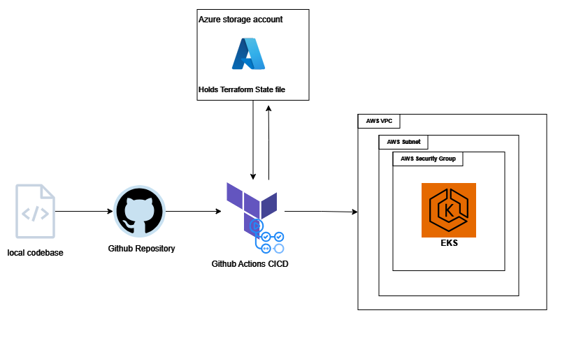
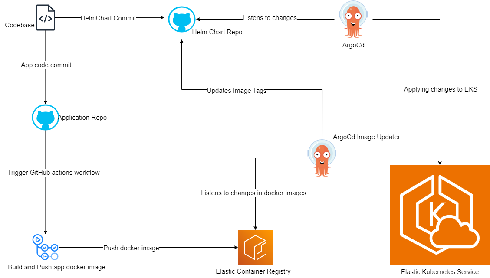
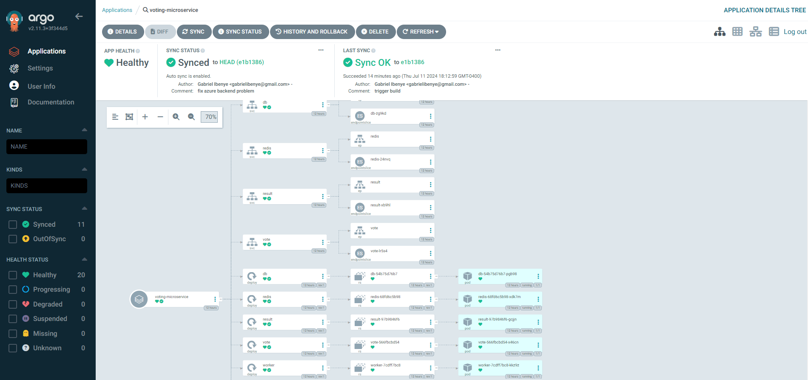

# Voting App Deployment Documentation

- [Voting App Deployment Documentation](#voting-app-deployment-documentation)
  - [Introduction](#introduction)
  - [Prerequisites](#prerequisites)
  - [Infrastructure Setup](#infrastructure-setup)
    - [Provisioning AWS EKS Cluster with Terraform](#provisioning-aws-eks-cluster-with-terraform)
  - [Application Deployment](#application-deployment)
    - [Helm Chart Overview](#helm-chart-overview)
    - [Helm Values Files](#helm-values-files)
  - [Continuous Integration/Continuous Deployment (CI/CD)](#continuous-integrationcontinuous-deployment-cicd)
    - [GitHub Actions Pipeline](#github-actions-pipeline)
    - [Argo CD Configuration](#argo-cd-configuration)
    - [Infrastructure as Code (IaC) Pipeline](#infrastructure-as-code-iac-pipeline)
  - [Maintenance](#maintenance)
    - [Scaling Strategy](#scaling-strategy)
  - [Diagrams](#diagrams)
    - [Infrastructure deployment diagram](#infrastructure-deployment-diagram)
    - [Application deployment diagram](#application-deployment-diagram)
  - [Conclusion](#conclusion)

## Introduction

This document provides a comprehensive guide on deploying the Example Voting App using Kubernetes, Helm charts, GitHub Actions, Argo CD, and Terraform. It covers the setup of CI/CD pipelines for both application deployment and infrastructure management.

## Prerequisites

- AWS account with access to EKS, S3, ECR, and IAM services.
- Experience with Docker and GitHub Actions for CI/CD pipelines.
- Understanding of microservices architecture and deployment on EKS.
- Proficiency in Infrastructure as Code (IaC) using Terraform and Helm charting.
- Familiarity with DevSecOps practices.

## Infrastructure Setup

### Provisioning AWS EKS Cluster with Terraform

Utilized Terraform scripts to provision an AWS EKS cluster with an initial node count of 1, scaling up to a maximum of 5 nodes. Configured networking to allow traffic on ports 31000 (vote web page) and 31001 (result web page) via security group rules. Ensured security by implementing relevant firewall rules and IP restrictions.

[Click here for Infrastructure Deployment Details](infrastructure/README.md)

## Application Deployment

### Helm Chart Overview

Developed Helm chart templates for microservices:

- `hpa.yaml`: Horizontal Pod Autoscaler configuration.
- `deployment.yaml`: Deployment configurations for vote, result, and worker microservices.
- `service.yaml`: Service definitions for exposing microservices internally.
- `cronjob.yaml`: Scheduled jobs configuration.

### Helm Values Files

Created values files to customize deployment configurations for different environments and scaling requirements.

[Click here for more details about the helm charts](voting-app-helm-chart/README.md)
[Click here for details about the GitOps Deployment pipeline](CICD_PIPELINE.md)

## Continuous Integration/Continuous Deployment (CI/CD)

### GitHub Actions Pipeline

Implemented GitHub Actions pipeline for:

- Building Docker images for vote, result, and worker microservices.
- Automated scaling script for vote microservice during weekdays.

### Argo CD Configuration

Integrated Argo CD for continuous deployment of Helm charts to the EKS cluster upon updates to the Helm chart repository.

### Infrastructure as Code (IaC) Pipeline

Established a CI/CD pipeline for managing infrastructure changes using Terraform scripts. Automated application of Terraform changes to the AWS infrastructure upon code updates.
[Click here for to see pipeline script](.github/workflows/call-apply-terraform-eks-infra.yaml)

## Maintenance

To ensure the application handles varying traffic patterns effectively, I have implemented a scaling strategy for the vote microservice. This includes an automated script that adjusts the service's replicas during weekdays to accommodate higher traffic volumes.

### Scaling Strategy

- **Automated Scaling Script**: A GitHub Actions pipeline includes a script that automatically scales the vote microservice based on traffic patterns. The script increases the number of replicas during weekdays to manage higher traffic and scales down during weekends.

- **Horizontal Pod Autoscaler (HPA)**: Configured in the Helm charts (hpa.yaml) to adjust the number of pods based on CPU utilization and other relevant metrics.

[Click here to view Scaling python script](./scaler/scale-vote-hpa/scale_hpa.py)

## Diagrams

### Infrastructure deployment diagram

### Application deployment diagram

Click the links to visit the application

- [Voting App Link](http://3.143.234.149:31000/)
- [Result App Link](http://3.143.234.149:31001/)

---

---

## Conclusion

This documentation outlines the deployment process of the Voting App, leveraging AWS infrastructure, Kubernetes, Azure Storage, Helm charts, and CI/CD pipelines. It covers the setup and configuration required for deploying and maintaining a scalable and resilient application architecture in a cloud environment.
